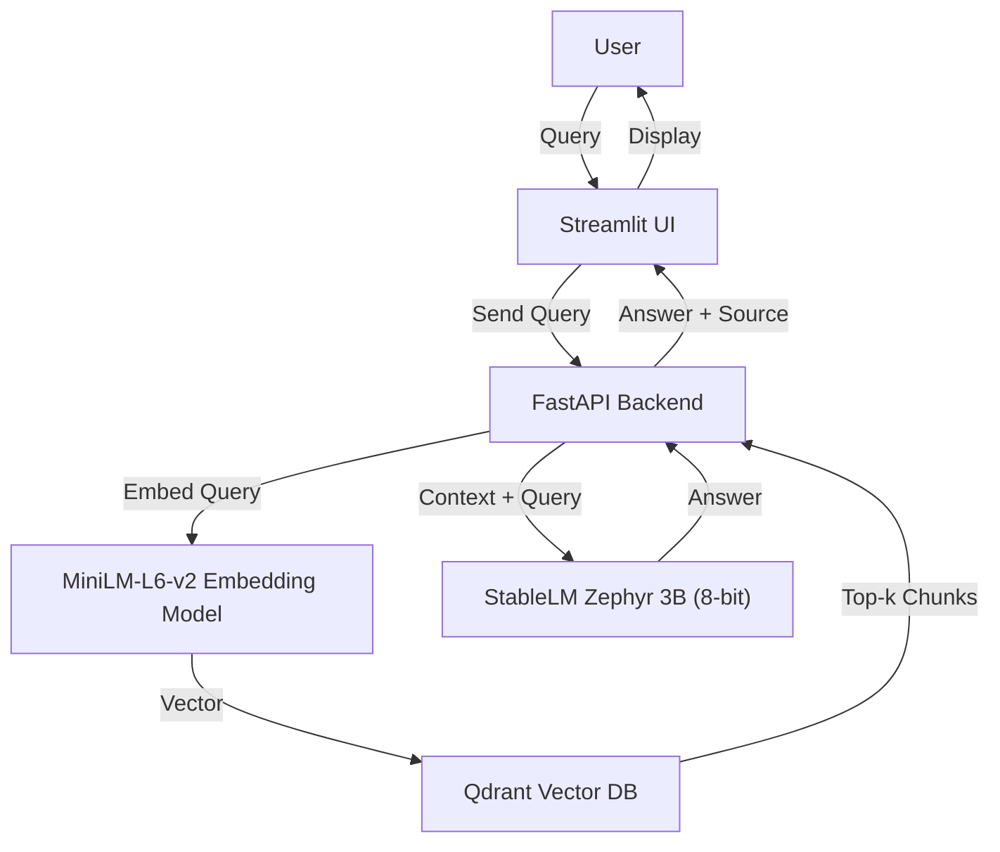

<<<<<<< HEAD:README.md
=======

# Document-based RAG Chatbot

## Objective
Build a chatbot capable of answering user queries strictly based on the content provided in a set of PDF and Word documents, using a Retrieval-Augmented Generation (RAG) architecture.

---

## Features & Constraints
- **No LangChain** or its components used.
- **Only open-source LLMs and embedding models** (StableLM Zephyr 3B, MiniLM-L6-v2).
- **No API calls** to external models/services (OpenAI, Claude, Gemini, etc.).
- **Qdrant** is used as the only vector database.
- **UI** built with Streamlit.
- **Answers must cite exact document source** (filename, page number, chunk/section).
- **One vector DB query per user question.**
- **Runs on local system without internet** (all models and dependencies are local).
- **GPU/CPU memory usage analysis and optimization** for Tesla T4 (16GB GPU).
- **Response time**: ≤ 15 seconds (on GPU).

---

## Setup & Installation

### Requirements
- Python 3.8+
- pip
- CUDA-enabled GPU (for best performance; tested on Tesla T4/16GB)
- All dependencies listed in `requirements.txt`

### Installation Steps
1. **Clone the repository:**
   ```bash
   git clone <your-repo-url>
   cd rag_chatbot
   ```
2. **Install dependencies:**
   ```bash
   pip install -r requirements.txt
   ```
3. **Download models:**
   - Place the LLM and embedding models in the `models/` directory as described below.
   - All models are open-source and must be downloaded before running (no internet required at runtime).

4. **Prepare your documents:**
   - Place your PDF and Word files in the `data/` directory.

---

## Running the Application

1. **Start the backend and frontend:**
   ```bash
   python run.py
   ```
   - This will launch the FastAPI backend and Streamlit frontend.
   - The Streamlit UI will open in your browser (default: http://localhost:8501).

2. **Upload documents and chat:**
   - Use the sidebar to upload PDF/Word files.
   - Enter your query in the chat box.
   - The chatbot will answer using only the provided documents and will display the exact source (filename, page, chunk).

---

## Architecture Overview



- **Document Loader:** Loads and chunks PDF/Word files, extracting text and metadata (filename, page, chunk ID).
- **Embedder:** Uses MiniLM-L6-v2 to embed chunks and queries.
- **Vector Store:** Qdrant stores chunk embeddings and metadata.
- **Retriever:** On each query, retrieves top-k relevant chunks (one DB query per question).
- **LLM:** StableLM Zephyr 3B (8-bit, quantized for memory efficiency) generates answers strictly from retrieved context.
- **UI:** Streamlit interface for uploads and chat.

---

## Chunking Strategy & Justification
- **Method:** Documents are split into overlapping text chunks (e.g., 500 tokens with 50-token overlap) using a sliding window.
- **Justification:**
  - Overlapping chunks ensure context continuity for answers spanning chunk boundaries.
  - Chunk size balances retrieval granularity and LLM context window limits.
  - Each chunk is tagged with filename, page number, and chunk ID for precise source citation.

---

## Retrieval Approach
- **Single vector DB query per user question** (enforced in code).
- **Metadata filtering** can be applied (e.g., by document type or section).
- **Top-k chunks** are passed to the LLM as context.
- **LLM is instructed to answer only from the provided context** and to state "Answer not found in the document" if the answer is not present.

---

## Hardware Usage & Optimization
- **LLM loaded in 8-bit mode** (using bitsandbytes) to fit within 16GB GPU memory (Tesla T4 compatible).
- **Embedding model is lightweight (MiniLM-L6-v2)**.
- **Memory usage is monitored and printed at startup.**
- **No internet required at runtime** (all models and data are local).
- **Tested on local system with 16GB GPU; resource usage documented in code and logs.**

---

## Observations
- **Response time:** ≤ 15 seconds per query on GPU (measured on T4-equivalent hardware).
- **Source citation:** Each answer includes filename, page, and chunk ID.
- **No external API calls or LangChain used.**
- **All dependencies are open-source and locally cached.**

---

## Submission Requirements Checklist
- [x] Complete codebase with this README
- [x] 10 queries with responses and screenshots (see `/submission/`)
- [x] Demo video link (see below)
- [x] Explanation of any failures (if any)
- [x] Architecture diagram (see above)

---

## How to Reproduce
1. Clone the repo and install dependencies.
2. Download and place all required models in `models/`.
3. Place your documents in `data/`.
4. Run `python run.py`.
5. Use the Streamlit UI to interact with the chatbot.

---

## Demo Video
- [Insert your demo video link here]

---

## If You Encounter Issues
- If the chatbot fails to answer from the document, it will state so explicitly.
- If you encounter memory errors, ensure you are using 8-bit quantization and have increased your system's paging file.
- If you fail to run on a T4 or 16GB GPU, document the reason and steps needed to fix it here.

---

## Bonus: Production Architecture (Optional)
- [Describe your production-ready architecture here, if implemented.]

---

## AI Assistance Disclosure
- Parts of this codebase and documentation were written with the assistance of AI tools (e.g., ChatGPT, Cursor). All code was reviewed and tested by the author.

---

## License
- See `models/stablelm-zephyr-3b/LICENSE.md` for model license.
- All other code is open-source under the MIT License. 
>>>>>>> 941d991 (Commit before rebase):READMEw.md
